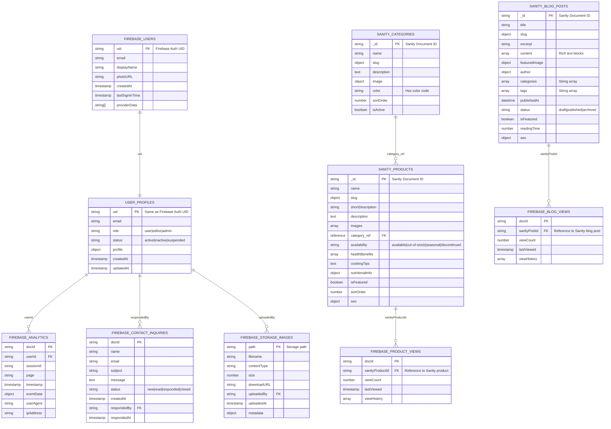

# 🏗️ MYCOgenesis_WEB - Architecture & ER Diagram
**Updated with Phase 1 Enhancements & Scalable Architecture Features**

## 📋 **Table of Contents**
- [System Overview](#-system-overview)
- [Enhanced Entity Relationship Diagram](#-enhanced-entity-relationship-diagram)
- [Enhanced Service Layer Architecture](#-enhanced-service-layer-architecture)
- [Firebase Integration Architecture](#-firebase-integration-architecture)
- [Sanity CMS Enhanced Architecture](#-sanity-cms-enhanced-architecture)
- [Performance & Resilience Systems](#-performance--resilience-systems)
- [Data Flow Diagrams](#-data-flow-diagrams)
- [Security & Access Control](#-security--access-control)
- [Scalability & Future Architecture](#-scalability--future-architecture)
- [API Integration Points](#-api-integration-points)

---

## 🌟 **System Overview**

MYCOgenesis_WEB is a hybrid content management system using **dual data sources**:
- **Sanity.io CMS**: Primary content management (Products, Blog Posts, Categories)
- **Firebase**: Authentication, user management, analytics, and real-time features

```
┌─────────────────────────────────────────────────────────────────────────┐
│                         MYCOgenesis_WEB ECOSYSTEM                        │
├─────────────────────────────────────────────────────────────────────────┤
│                                                                         │
│  ┌─────────────┐    ┌─────────────┐    ┌─────────────┐                 │
│  │   Frontend  │    │   Sanity    │    │   Firebase  │                 │
│  │   Website   │◄───┤     CMS     │    │   Backend   │                 │
│  │             │    │             │    │             │                 │
│  └─────────────┘    └─────────────┘    └─────────────┘                 │
│         │                   │                   │                      │
│         │                   │                   │                      │
│  ┌─────────────┐    ┌─────────────┐    ┌─────────────┐                 │
│  │   Users     │    │   Content   │    │    Admin    │                 │
│  │ (Public)    │    │  Editors    │    │   Users     │                 │
│  │             │    │             │    │             │                 │
│  └─────────────┘    └─────────────┘    └─────────────┘                 │
│                                                                         │
└─────────────────────────────────────────────────────────────────────────┘
```

---

## 🗄️ **Enhanced Entity Relationship Diagram**

### **Core Entities & Relationships (Including Phase 1 Enhancements)**



---

## 🔥 **Firebase Integration Architecture**

### **Firebase Services Configuration**

```javascript
// Firebase Configuration Structure
const firebaseConfig = {
    projectId: "mycogen-57ade",
    authDomain: "mycogen-57ade.firebaseapp.com",
    databaseURL: "https://mycogen-57ade-default-rtdb.firebaseio.com",
    storageBucket: "mycogen-57ade.firebasestorage.app",
    // ... other config
}

// Initialized Services
┌─────────────────────────────────────────────────────────────────────┐
│                      FIREBASE SERVICES                             │
├─────────────────────────────────────────────────────────────────────┤
│                                                                     │
│  🔐 AUTHENTICATION      🗄️  FIRESTORE         📁 STORAGE           │
│  ├─ Email/Password      ├─ users/             ├─ images/           │
│  ├─ Google OAuth        ├─ blogs/             ├─ uploads/          │
│  ├─ Facebook OAuth      ├─ products/          ├─ temp/             │
│  ├─ Role-based access   ├─ contact-inquiries/ └─ user-avatars/     │
│  └─ Session management  ├─ analytics/                              │
│                         └─ blog-views/         📊 ANALYTICS        │
│                                                ├─ Page views       │
│  🔴 REALTIME DATABASE   ⚡ FUNCTIONS           ├─ User behavior    │
│  ├─ IoT sensor data     ├─ Image processing   ├─ Content metrics  │
│  ├─ Live notifications  ├─ Email triggers     └─ Business insights│
│  └─ Connection status   └─ Data validation                        │
│                                                                     │
└─────────────────────────────────────────────────────────────────────┘
```

### **Firebase Collections Schema**

```yaml
# Firestore Collections Structure

users/{uid}:
  uid: string                    # Firebase Auth UID
  email: string                  # User email
  role: string                   # "user" | "editor" | "admin"
  status: string                 # "active" | "inactive" | "suspended"
  profile:
    displayName: string
    photoURL: string
    bio: string
    preferences: object
  createdAt: timestamp
  updatedAt: timestamp

contact-inquiries/{docId}:
  name: string
  email: string
  subject: string
  message: string
  status: string                 # "new" | "read" | "responded" | "closed"
  createdAt: timestamp
  respondedBy: string            # User UID
  respondedAt: timestamp

analytics/{docId}:
  userId: string                 # User UID (optional)
  sessionId: string
  page: string
  event: string
  data: object
  timestamp: timestamp
  userAgent: string
  ipAddress: string

blog-views/{docId}:
  sanityPostId: string          # Reference to Sanity blog post
  viewCount: number
  lastViewed: timestamp
  viewHistory: array

product-views/{docId}:
  sanityProductId: string       # Reference to Sanity product
  viewCount: number
  lastViewed: timestamp
  viewHistory: array
```

---

## 🎨 **Sanity CMS Architecture**

### **Sanity Schema Structure**

```javascript
// Sanity Content Types
┌─────────────────────────────────────────────────────────────────────┐
│                        SANITY CMS SCHEMAS                          │
├─────────────────────────────────────────────────────────────────────┤
│                                                                     │
│  🍄 PRODUCTS              🏷️  CATEGORIES           📝 BLOG_POSTS    │
│  ├─ _id                   ├─ _id                    ├─ _id          │
│  ├─ name                  ├─ name                   ├─ title        │
│  ├─ slug                  ├─ slug                   ├─ slug         │
│  ├─ shortDescription      ├─ description            ├─ excerpt      │
│  ├─ description           ├─ image                  ├─ content[]    │
│  ├─ images[]              ├─ color                  ├─ featuredImage│
│  ├─ category (ref)        ├─ sortOrder              ├─ author       │
│  ├─ availability          ├─ isActive               ├─ categories[] │
│  ├─ healthBenefits[]      └─ ...                    ├─ tags[]       │
│  ├─ cookingTips                                     ├─ publishedAt  │
│  ├─ nutritionalInfo       🔍 SEO FIELDS             ├─ status       │
│  ├─ isFeatured            ├─ metaTitle              ├─ isFeatured   │
│  ├─ sortOrder             ├─ metaDescription        ├─ readingTime  │
│  └─ seo                   └─ keywords[]             └─ seo          │
│                                                                     │
└─────────────────────────────────────────────────────────────────────┘
```

### **Sanity Data Relationships**

```
CATEGORIES ──────────┐
    │                │
    │ (1:many)       │
    ▼                │
PRODUCTS             │
    │                │
    │ (referenced)   │
    ▼                ▼
BLOG_POSTS ─────── SEO_DATA
    │
    │ (embedded)
    ▼
RICH_CONTENT[]
├─ Text blocks
├─ Images  
├─ Callouts
└─ Links
```

---

## 🔄 **Data Flow Diagrams**

### **Content Loading Flow**

```
┌─────────────┐    API Call    ┌─────────────┐    Transform    ┌─────────────┐
│   Frontend  │───────────────►│   Sanity    │───────────────►│   Service   │
│   Website   │                │     CMS     │                │   Layer     │
└─────────────┘                └─────────────┘                └─────────────┘
       ▲                                                              │
       │                                                              ▼
       │                        Rendered HTML                ┌─────────────┐
       └──────────────────────────────────────────────────────│   Content   │
                                                              │ Transformers│
                                                              └─────────────┘
```

### **Authentication Flow**

```
┌─────────────┐    Login     ┌─────────────┐    Token      ┌─────────────┐
│    User     │─────────────►│   Firebase  │──────────────►│  Frontend   │
│             │              │    Auth     │               │   Website   │
└─────────────┘              └─────────────┘               └─────────────┘
       ▲                             │                             │
       │          Profile            ▼                             ▼
       │         Creation    ┌─────────────┐     Role Check ┌─────────────┐
       └────────────────────│  Firestore  │◄───────────────│    Auth     │
                            │    Users    │                │  Middleware │
                            └─────────────┘                └─────────────┘
```

### **Real-time Update Flow**

```
┌─────────────┐   Content    ┌─────────────┐   Webhook    ┌─────────────┐
│   Editor    │─────────────►│   Sanity    │─────────────►│  Website    │
│   (CMS)     │              │    Studio   │              │   Frontend  │
└─────────────┘              └─────────────┘              └─────────────┘
                                     │                           │
┌─────────────┐   Analytics  ┌─────────────┐   Listener   ┌─────────────┐
│  User       │─────────────►│  Firebase   │─────────────►│  Real-time  │
│ Activity    │              │  Firestore  │              │  Updates    │
└─────────────┘              └─────────────┘              └─────────────┘
```

---

## 🛠️ **Service Layer Architecture**

### **JavaScript Services Structure**

```javascript
// Service Layer Organization
┌─────────────────────────────────────────────────────────────────────┐
│                         SERVICE LAYER                              │
├─────────────────────────────────────────────────────────────────────┤
│                                                                     │
│  🎨 SANITY SERVICE           🔥 FIREBASE SERVICES                   │
│  ├─ sanity-service.js        ├─ firebase-config.js                 │
│  │  ├─ getFeaturedProducts   ├─ firebase-init.js                   │
│  │  ├─ getAvailableProducts  ├─ auth/                               │
│  │  ├─ getBlogPosts          │  ├─ login.js                        │
│  │  ├─ getBlogPost           │  ├─ signup.js                       │
│  │  ├─ getCategories         │  └─ shared-auth.js                  │
│  │  └─ transformData         └─ utils/                              │
│                                 ├─ db-user-checker.js               │
│  📊 CONTENT SERVICES            ├─ user-profile-migration.js        │
│  ├─ public-content-service     └─ delete-user-account.js            │
│  ├─ real-time-content-service                                      │
│  └─ content loaders            🔧 UTILITY SERVICES                  │
│     ├─ blog-loader.js          ├─ validation.js                    │
│     ├─ product-loader.js       ├─ image-optimization.js             │
│     └─ dynamic-content/        └─ error-handling.js                 │
│                                                                     │
└─────────────────────────────────────────────────────────────────────┘
```

### **Service Integration Pattern**

```javascript
// Service Integration Example
class ContentIntegrationService {
    constructor() {
        this.sanityService = sanityService;        // Sanity CMS data
        this.firebaseService = firebaseServices;   // Firebase backend
        this.realTimeService = realTimeContentService; // Live updates
    }

    async loadPageContent(pageType, options) {
        // 1. Load content from Sanity
        const sanityData = await this.sanityService.getContent(pageType, options);
        
        // 2. Enhance with Firebase data
        const firebaseData = await this.firebaseService.getAnalytics(pageType);
        
        // 3. Setup real-time listeners
        this.realTimeService.setupListeners(pageType);
        
        // 4. Return combined data
        return this.mergeData(sanityData, firebaseData);
    }
}
```

---

## 🔒 **Security & Access Control**

### **Firebase Security Rules**

```javascript
// Firestore Security Rules Structure
rules_version = '2';
service cloud.firestore {
  match /databases/{database}/documents {
    
    // User profiles - users can read/write their own
    match /users/{userId} {
      allow read, write: if request.auth != null 
                         && request.auth.uid == userId;
      allow read: if request.auth != null 
                  && get(/databases/$(database)/documents/users/$(request.auth.uid)).data.role in ['admin', 'editor'];
    }
    
    // Contact inquiries - authenticated users can create, admins can manage
    match /contact-inquiries/{docId} {
      allow create: if request.auth != null;
      allow read, update, delete: if request.auth != null 
                                   && get(/databases/$(database)/documents/users/$(request.auth.uid)).data.role == 'admin';
    }
    
    // Analytics - system writes, admins read
    match /analytics/{docId} {
      allow create: if request.auth != null;
      allow read: if request.auth != null 
                  && get(/databases/$(database)/documents/users/$(request.auth.uid)).data.role == 'admin';
    }
    
    // View counters - public read, system increment
    match /{viewType}-views/{docId} {
      allow read: if true;
      allow write: if request.auth != null;
    }
  }
}
```

### **Role-Based Access Control**

```yaml
# User Roles & Permissions
roles:
  user:
    permissions:
      - read: public content
      - create: contact inquiries
      - update: own profile
    
  editor:
    inherits: user
    permissions:
      - access: Sanity CMS
      - create: blog posts, products
      - update: blog posts, products
      - read: analytics dashboard
    
  admin:
    inherits: editor
    permissions:
      - full access: all systems
      - manage: users, roles
      - delete: any content
      - access: full analytics
      - manage: system settings
```

---

## 🔌 **API Integration Points**

### **External API Endpoints**

```yaml
# Sanity CMS API
sanity_api:
  base_url: "https://[PROJECT_ID].api.sanity.io"
  version: "v2024-01-01"
  endpoints:
    products: "/data/query/production"
    blog_posts: "/data/query/production"
    categories: "/data/query/production"
    images: "/images/production"

# Firebase APIs
firebase_api:
  auth: "https://identitytoolkit.googleapis.com/v1"
  firestore: "https://firestore.googleapis.com/v1"
  storage: "https://storage.googleapis.com/storage/v1"
  analytics: "https://www.googleapis.com/analytics/v3"

# Content Delivery
cdn:
  sanity_images: "https://cdn.sanity.io/images/[PROJECT_ID]/production"
  firebase_storage: "https://firebasestorage.googleapis.com/v0/b/[BUCKET]/o"
```

### **Data Synchronization Flow**

```
Content Creation Flow:
1. Editor creates content in Sanity Studio
2. Sanity validates and stores content
3. Website polls Sanity API for updates
4. Content is transformed and cached
5. Real-time service notifies users of updates

User Interaction Flow:
1. User interacts with website (view, click, etc.)
2. Analytics event sent to Firebase
3. User preferences stored in Firestore
4. Real-time listeners update UI accordingly
5. Admin dashboard shows updated metrics
```

---

## 📊 **Performance & Monitoring**

### **Caching Strategy**

```javascript
// Multi-layer Caching
┌─────────────────────────────────────────────────────────────────────┐
│                         CACHING LAYERS                             │
├─────────────────────────────────────────────────────────────────────┤
│                                                                     │
│  🌐 CDN CACHE              🏠 LOCAL STORAGE         💾 SERVICE WORKER│
│  ├─ Sanity images          ├─ User preferences      ├─ Offline pages │
│  ├─ Static assets          ├─ Recent blog posts     ├─ API responses │
│  └─ Transformed content    ├─ Product catalog       └─ Asset cache   │
│                            └─ Auth tokens                            │
│  ⚡ MEMORY CACHE           🔄 API CACHE             📱 BROWSER CACHE │
│  ├─ Component state        ├─ Sanity responses      ├─ Static files  │
│  ├─ User session          ├─ Firebase data         ├─ CSS/JS        │
│  └─ Navigation data       └─ Analytics events      └─ Images        │
│                                                                     │
└─────────────────────────────────────────────────────────────────────┘
```

### **Monitoring Points**

```yaml
# System Monitoring
monitoring:
  performance:
    - page_load_times
    - api_response_times
    - image_loading_speed
    - time_to_first_contentful_paint
  
  availability:
    - sanity_cms_uptime
    - firebase_services_status
    - website_uptime
    - cdn_performance
  
  user_experience:
    - bounce_rate
    - page_views
    - user_interactions
    - conversion_metrics
  
  errors:
    - javascript_errors
    - api_failures
    - authentication_issues
    - content_loading_failures
```

---

## 🚀 **Deployment Architecture**

### **Hosting & Deployment Strategy**

```
┌─────────────────────────────────────────────────────────────────────┐
│                     DEPLOYMENT PIPELINE                            │
├─────────────────────────────────────────────────────────────────────┤
│                                                                     │
│  📝 DEVELOPMENT          🔧 BUILD PROCESS           🚀 DEPLOYMENT    │
│  ├─ Local development    ├─ Asset optimization      ├─ Firebase     │
│  ├─ Sanity Studio        ├─ Code minification       │   Hosting     │
│  ├─ Firebase emulators   ├─ Image compression       ├─ Vercel       │
│  └─ Hot reloading        └─ Bundle generation       │   (recommended)│
│                                                     └─ Custom CDN   │
│  🧪 TESTING              ⚙️  CONFIGURATION                          │
│  ├─ Unit tests           ├─ Environment variables   📊 MONITORING   │
│  ├─ Integration tests    ├─ Security rules         ├─ Error tracking│
│  ├─ Performance tests    ├─ API keys management    ├─ Analytics     │
│  └─ Security audits      └─ Database indexes       └─ Alerts       │
│                                                                     │
└─────────────────────────────────────────────────────────────────────┘
```

---

## 🎯 **Key Integration Points Summary**

### **Critical Data Flows**

1. **Content Management**: Sanity CMS → Service Layer → Frontend Display
2. **User Authentication**: Firebase Auth → User Profile Creation → Role-based Access
3. **Real-time Updates**: Content Changes → WebSocket → Live UI Updates
4. **Analytics**: User Actions → Firebase Analytics → Admin Dashboard
5. **File Management**: User Uploads → Firebase Storage → CDN Delivery

### **System Dependencies**

```yaml
# Critical Dependencies
critical_services:
  - firebase_auth: "User authentication and session management"
  - sanity_cms: "Content creation and management"
  - firebase_firestore: "User data and analytics storage"
  - firebase_storage: "File uploads and media management"

optional_services:
  - firebase_analytics: "User behavior tracking"
  - firebase_realtime_db: "IoT sensor data (future feature)"
  - firebase_functions: "Server-side processing (future feature)"
  - third_party_apis: "Payment processing, email services (future)"
```

This architecture provides a robust, scalable foundation for the MYCOgenesis mushroom farming business website, with clear separation of concerns, security-first design, and excellent user experience through real-time updates and optimized content delivery.

---

**Last Updated**: August 2024  
**Version**: 1.0  
**Maintainer**: MYCOgenesis Development Team
